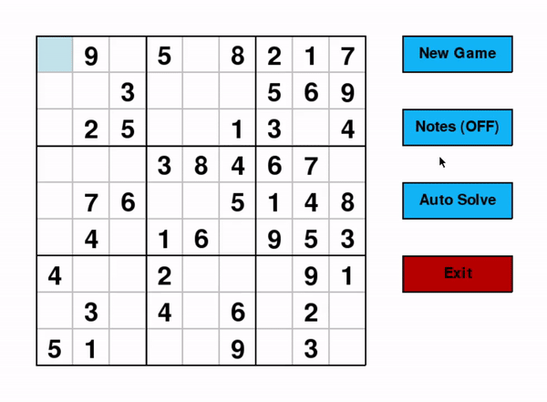

<!-- INTRO -->
# Sudoku

  

 

<!-- TABLE OF CONTENTS -->
# Table of Contents

* [About the Project](#about-the-project)
  * [Built With](#built-with)
* [Game Features](#game-features)
  * [Menu](#menu)
  * [Input Numbers](#input-numbers)
  * [Movement](#movement)
  * [Generating New Puzzles](#generating-new-puzzles)
  * [Notes Feature](#notes-feature)
  * [Auto Solve Function](#auto-solve-function)

<!-- ABOUT THE PROJECT -->
# About The Project

This project allows the user to play sudoku board game with fully functional GUI as well as demonstrate a backtracking algorithm that is capable of solving any puzzle.

## Built With

* [Pygame](https://www.pygame.org/)

<!-- GAME FEATURES -->
# Game Features

## Menu
Menu that displays when the game is started.

## Input Numbers
Light blue higlighted position allows users to input a number in a any of the boxes. Number turns red to indicate a duplicate number within the row, column, or box. Duplicated numbers are highlighted in a red box. Numbers in black (generated at each new game) cannot be changed.

## Movement
The player is a ble to move the current cursor position using the arrow keys. Alternatively, clicking on any square will change the cursor position as well.

## Generating New Puzzles
Clicking on the new game button will automatically generate a new sudoku puzzle. New puzzles are unique and only have one viable solution.

## Notes Feature
The player can toggle the notes feature to leave a number note (1-9) within a cube. Notes are deleted by pressing the DEL button or inputting any number in the cube.

## Auto Solve Function

